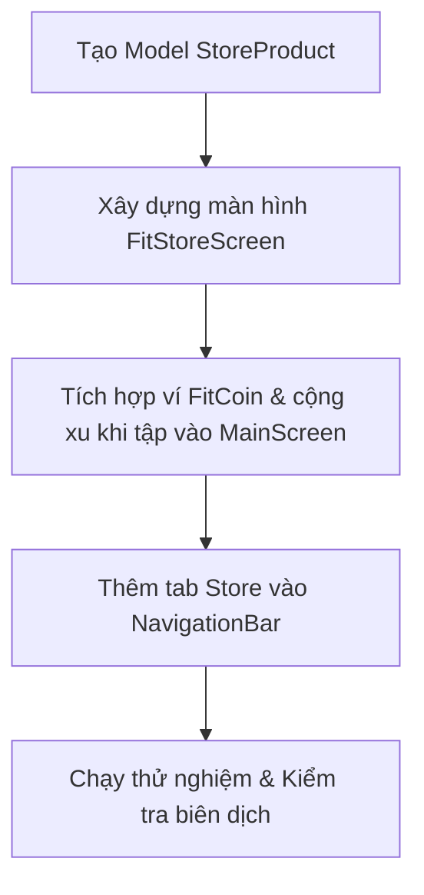

# Báo Cáo Kiểm Tra & Kế Hoạch Hoàn Thiện Dự Án AI Fit Tracker 🚀

Dự án **AI Fit Tracker** đã được kiểm tra chi tiết cấu trúc thư mục, cấu hình Gradle, các lớp xử lý AI Pose và giao diện Jetpack Compose. 

Dưới đây là báo cáo đánh giá hiện trạng và kế hoạch hành động để chúng ta **hoàn thiện ứng dụng ngay trong hôm nay**.

---

## 📊 1. Đánh Giá Hiện Trạng Dự Án

Sau khi quét toàn bộ mã nguồn, tôi nhận thấy dự án đã có nền tảng PoC (Proof of Concept) cực kỳ tốt:
*   **AI Engine (`PoseAnalyzer.kt`):** Đã triển khai thuật toán tính góc và xử lý trạng thái cho **5 bài tập**: Squats, Push-ups, Planks, Jumping Jacks, và Bicep Curls.
*   **Camera & Overlay:** Luồng CameraX và canvas vẽ skeleton đè lên camera hoạt động ổn định và tối ưu.
*   **Giao diện UI chính:** Đã có hệ thống Bottom Navigation chia thành 5 tab: Workouts, Rooms (Phòng tập chung), FitTok (Feed video ngắn), Coach (Kết nối PT) và Rank (Bảng xếp hạng).

### 🔍 Điểm Thiếu Sót (So với [Ý tưởng.md](file:///home/longnhat/Obsidian%20Vault/01%20Projects/AI-Fit-Tracker/app/%C3%9D%20t%C6%B0%E1%BB%9Fng.md) và [PRODUCT_VISION.md](file:///home/longnhat/Obsidian%20Vault/01%20Projects/AI-Fit-Tracker/PRODUCT_VISION.md)):
*   **Tính năng số 5 trong Ý tưởng ("Có shop bán đồ liên quan đến tập luyện"):** Chưa có giao diện Cửa hàng (FitStore).
*   **Nền kinh tế FitCoin (Move-to-Earn):** Chưa có cơ chế tích lũy xu khi tập luyện và ví lưu trữ số dư.

---

## 🛠️ 2. Kế Hoạch Hoàn Thiện Trong Hôm Nay

Tôi đề xuất chúng ta triển khai nâng cấp 3 phần cốt lõi để hoàn thành 100% tính năng mong muốn:

### Chi tiết các bước thực hiện:
1.  **Bước 1: Định nghĩa Model:** Tạo `StoreProduct.kt` đại diện cho các sản phẩm (Whey Protein, bình nước thông minh, voucher Nike...) có giá trị quy đổi bằng tiền mặt + FitCoin.
2.  **Bước 2: Viết giao diện `FitStoreScreen.kt`:** 
    *   Hiển thị số dư Ví FitCoin màu vàng Gold nổi bật.
    *   Danh mục sản phẩm lọc nhanh (All, Equipment, Nutrition, Vouchers).
    *   Nút "ĐỔI QUÀ" mở hộp thoại chúc mừng thành công và trừ xu.
3.  **Bước 3: Tích hợp Ví FitCoin vào `MainScreen.kt`:**
    *   Tự động cộng **5 FitCoins** cho mỗi Rep hoàn thành đúng tư thế (Squat, Push-up, Jumping Jack, Bicep Curl).
    *   Tự động cộng **10 FitCoins** mỗi 10 giây giữ Plank đúng tư thế.
    *   Phát âm thanh/tts thông báo số xu nhận được.
4.  **Bước 4: Nâng cấp Navigation Bar:** Thêm tab thứ 6 "Store" vào thanh điều hướng dưới cùng của màn hình chính.

---

## 💡 Ý kiến của bạn?

Tôi đã sẵn sàng bắt tay vào viết mã nguồn cho các bước trên. Bạn có muốn điều chỉnh gì về cơ chế cộng điểm FitCoin hoặc danh mục sản phẩm trước khi tôi tiến hành không?
