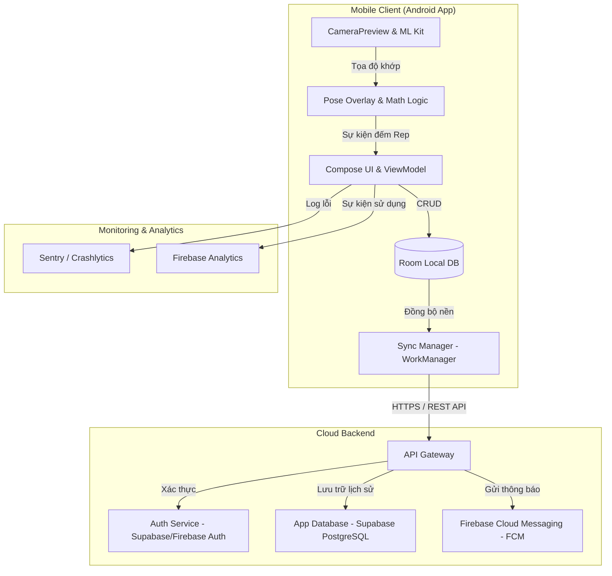
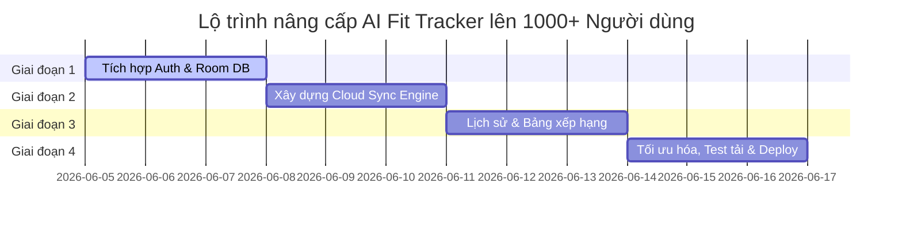

# Kế Hoạch Mở Rộng: AI Fit Tracker lên 1000+ Người Dùng

> **Tổng quan:** Bản kế hoạch này hướng dẫn cách chuyển đổi ứng dụng AI Fit Tracker từ phiên bản PoC (chạy local hoàn toàn) thành một sản phẩm sẵn sàng phục vụ hơn **1,000 người dùng hoạt động** (Active Users), đảm bảo bảo mật dữ liệu, đồng bộ hóa đám mây và tối ưu hóa chi phí vận hành.

---

## 1. 🏗️ Sơ Đồ Kiến Trúc Hệ Thống (Architecture)

Vì tính năng **Pose Detection** của chúng ta chạy **trực tiếp trên thiết bị của người dùng (On-device AI)** sử dụng Google ML Kit, gánh nặng tính toán AI được phân tán hoàn toàn. Server của chúng ta chỉ cần xử lý các tác vụ nhẹ như xác thực (Auth), lưu lịch sử tập luyện và bảng xếp hạng (Leaderboard). điều này giúp hệ thống hoạt động ổn định và cực kỳ tiết kiệm chi phí.

---

## 2. 🛠️ Đề Xuất Tech Stack Cho Mở Rộng

Để phục vụ hơn 1000 người dùng một cách nhanh chóng với chi phí tối ưu (thậm chí nằm trong gói Free Tier), chúng ta nên tích hợp các công nghệ sau:

| Thành phần | Công nghệ đề xuất | Lý do lựa chọn |
| :--- | :--- | :--- |
| **Authentication** | **Supabase Auth** hoặc **Firebase Auth** | Hỗ trợ đăng nhập bằng Email/Password, Google, Apple cực nhanh, bảo mật cao mà không cần viết code backend riêng. |
| **Database** | **Supabase (PostgreSQL)** hoặc **Firebase Firestore** | - Supabase cung cấp PostgreSQL mạnh mẽ, dễ viết API qua Client SDK. - Firestore có cơ chế đồng bộ realtime cực tốt. |
| **Local DB (Offline-first)** | **Android Room DB** | Người dùng có thể tập ở phòng Gym (nơi sóng yếu/không có mạng). Dữ liệu lịch sử sẽ lưu local trước và tự đồng bộ lên Cloud khi có mạng. |
| **Sync Engine** | **Android WorkManager** | Đảm bảo tác vụ đồng bộ lịch sử tập luyện lên Cloud được thực thi ngầm kể cả khi người dùng tắt app hoặc thiết bị khởi động lại. |
| **Monitoring** | **Firebase Crashlytics** | Theo dõi và cảnh báo lỗi crash app trên thiết bị người dùng thời gian thực. |

---

## 3. 💾 Thiết Kế Cơ Sở Dữ Liệu (Database Schema)

Để lưu trữ thông tin của 1000+ người dùng, cấu trúc cơ sở dữ liệu cần đơn giản và hiệu quả:

### Bảng `users` (Thông tin người dùng)
- `id`: UUID (Primary Key, khớp với Auth UID)
- `display_name`: VARCHAR(100)
- `email`: VARCHAR(255)
- `created_at`: TIMESTAMP

### Bảng `workout_logs` (Nhật ký tập luyện)
- `id`: UUID (Primary Key)
- `user_id`: UUID (Foreign Key trỏ đến `users.id`)
- `exercise_type`: VARCHAR(50) (Ví dụ: "SQUAT")
- `reps_count`: INT
- `duration_seconds`: INT (Thời gian tập)
- `calories_burned`: FLOAT (Công thức ước tính)
- `created_at`: TIMESTAMP (Thời gian tập luyện thực tế)
- `synced_at`: TIMESTAMP (Đánh dấu trạng thái đã đồng bộ lên Cloud chưa)

---

## 🚀 4. Lộ Trình Triển Khai (12 Ngày)

### 📌 Giai đoạn 1: Xác Thực & Cơ sở dữ liệu nội bộ (Ngày 1 - 3)
*   **Xác thực:** Cài đặt Supabase/Firebase SDK. Tạo màn hình Đăng ký / Đăng nhập (Google Login & Email).
*   **Room DB:** Cài đặt Room Database trong Android App để lưu thông tin bài tập dưới dạng Offline-first.
*   **Repository Pattern:** Viết lớp `WorkoutRepository` điều phối dữ liệu giữa Local DB (Room) và Cloud API.

### 📌 Giai đoạn 2: Công Cụ Đồng Bộ Hóa Đám Mây (Ngày 4 - 6)
*   **Cơ sở dữ liệu đám mây:** Khởi tạo Supabase PostgreSQL / Firebase Firestore database.
*   **WorkManager:** Thiết lập background worker tự động kiểm tra kết nối mạng và đẩy dữ liệu tập luyện chưa đồng bộ (`synced_at = NULL`) lên Cloud database.
*   **Xử lý xung đột:** Đảm bảo khi người dùng dùng nhiều thiết bị khác nhau, dữ liệu lịch sử không bị ghi đè lẫn nhau.

### 📌 Giai đoạn 3: Dashboard & Bảng Xếp Hạng (Ngày 7 - 9)
*   **Giao diện lịch sử tập:** Thiết kế màn hình Dashboard hiển thị biểu đồ tiến trình tập luyện theo tuần/tháng (lấy dữ liệu từ Room DB).
*   **Social & Bảng xếp hạng (Leaderboard):** Thêm tính năng so sánh số reps tích lũy của 1000+ người dùng trong ngày để tăng tính tương tác xã hội (Gamification).

### 📌 Giai đoạn 4: Test Tải, Theo Dõi & Phát Hành (Ngày 10 - 12)
*   **Test Tải (Load Testing):** Mô phỏng 1000+ kết nối đồng thời ghi dữ liệu lên backend đám mây (đảm bảo DB không bị quá tải).
*   **Crashlytics & Analytics:** Tích hợp Firebase Crashlytics để thu thập lỗi tự động.
*   **Google Play Store:** Chuẩn bị tài nguyên hình ảnh, cấu hình tệp `build.gradle` (release mode, proguard bảo mật code) và đẩy app lên Google Play (Closed Beta).

---

> [!TIP]
> **Lưu ý tối ưu chi phí:** 
> Do Pose Detection sử dụng CPU/GPU on-device để xử lý hình ảnh 30fps, **chi phí server tính toán AI của chúng ta bằng $0**. Chúng ta chỉ mất băng thông mạng rất nhỏ để lưu các gói tin JSON chứa số Reps và thời gian tập lên PostgreSQL. Với 1000 người dùng, bạn hoàn toàn có thể chạy miễn phí 100% trên nền tảng Supabase Free Tier.
